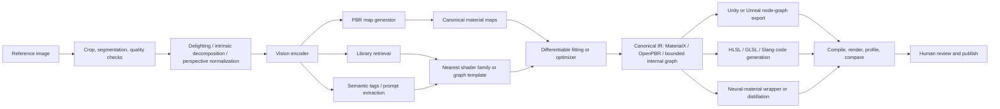
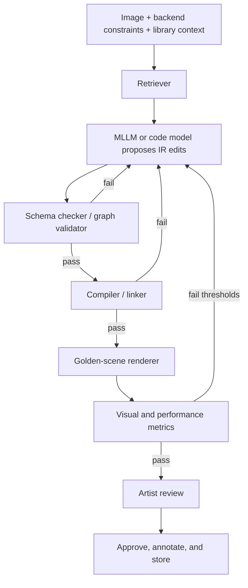

# Can Generative Models Turn a 2D Image into a Shader

## Executive Summary

The short answer is **yes for constrained shader representations, partially for editable procedural materials, and not yet reliably for arbitrary hand-written fragment shader code**. The strongest existing results map one or a few 2D images to **PBR or SVBRDF material maps** such as base color, normal, roughness, height, metallic, and opacity, or to **neural material representations** that can later be rendered or fit to analytical models. That line of work is already mature enough for production-adjacent use: examples include rendering-aware single-image SVBRDF estimation, generative inverse rendering with GANs and diffusion, real-photo material generation, image-conditioned tileable material synthesis, and recent DiT-based multimodal material generators. citeturn24view0turn23view0turn19view6turn21view0turn19view4turn18view8

The frontier has recently moved from “image to maps” toward **image to editable procedural material programs or graphs**, but the successful systems are still bounded by a specific graph language or DSL rather than generating arbitrary engine shaders end to end. citeturn14search6turn14search5turn19view0turn18view3 entity["company","Adobe","creative software company"]’s production tools and the broader industry also reflect this: commercial offerings focus on single-image **PBR material generation**, procedural graph authoring, and texture-map replacement, not on unconstrained image→GLSL/HLSL code synthesis. citeturn29view0turn29view1turn26view4turn25view0turn37view2

The most rigorous conclusion, therefore, is that **an image→shader pipeline should be designed as a representation ladder, not a monolith**. For most practical products, the right target is one of four outputs: **parameter sets for an existing uber-shader, PBR texture maps for a standard material model, an editable node graph in a bounded material DSL, or a neural material that is later distilled or wrapped for runtime use**. Direct image→raw fragment shader code generation is technically possible via retrieval and LLM tooling, but today it is best treated as a **tool-assist layer over a handcrafted library and a verification loop**, not as a trusted one-shot generator. citeturn25view0turn25view2turn36search9turn35search2turn28view0turn34search7turn35search7

Because the target rendering platform, real-time budget, and preferred shader language are unspecified, the most future-proof architecture is to use **a canonical intermediate representation** such as **MaterialX + OpenPBR** or a carefully constrained internal graph IR, and only then export to engine-specific formats or source code. That keeps the system aligned with both current research and current tooling. citeturn25view0turn25view2turn26view4turn27search0turn26view2

## Definitions and Scope

At the lowest level, a shader is executable GPU code. In the entity["organization","Khronos Group","graphics standards body"] ecosystem, GLSL fragment shaders are linked into a program object that runs on the programmable fragment processor; in the DirectX stack from entity["company","Microsoft","software company"], HLSL is the C-like language used for programmable shaders, including pixel shaders that process individual pixels and consume interpolated outputs from earlier stages. citeturn28view0turn26view0turn26view1

At a higher abstraction level, “shader” often means a **material shader** or **uber-shader**: a standardized physically based shading model with parameters controlling layers, base lobes, coat, fuzz, transmission, subsurface, and geometry opacity. OpenPBR is explicitly specified as such an uber-shader and is intended to cover most practical materials used in offline and real-time workflows. MaterialX, in turn, defines graph-based material descriptions and includes ShaderGen, which can build complete GLSL, OSL, MDL, and MSL shaders from MaterialX node graphs. citeturn25view2turn25view0

At the authoring-tool level, “shader” may instead mean a **node graph**. Shader Graph in entity["company","Unity","game engine company"] is a visual graph tool that lets users connect nodes instead of writing code, while the Material Editor in tools from entity["company","Epic Games","game engine company"] is a node-based graph interface for creating materials or shaders. In entity["organization","Academy Software Foundation","open source foundation"]’s MaterialX ecosystem, graphs are also the authoring primitive, and in Substance Designer, “Substance graphs” are explicitly described as graph programs that generate and process 2D image data, up to a full procedural material with multiple channels. citeturn26view2turn27search0turn25view0turn26view4

This immediately implies that “generate a shader from an image” is ambiguous. In practice, it can mean any of the following:

| Generated artifact | What is actually being produced | Editability | Runtime trustworthiness | Best current feasibility |
|---|---|---:|---:|---:|
| Parameter set | Values for an existing standard material or effect shader | High | High | High |
| PBR or SVBRDF maps | Base color, normal, roughness, metallic, height, opacity, etc. | Medium | High | High |
| Node graph | A bounded procedural material graph in Substance/MaterialX-like form | High | Medium | Medium |
| Source code | Raw GLSL, HLSL, Slang, or engine custom code | Medium | Low without verification | Low |
| Neural material | Compact learned appearance module or texture+MLP shader | Low to medium | Medium | Medium |

That table is the central taxonomy for the rest of the report. It reflects how official authoring systems, standards, and papers represent materials in practice. citeturn25view0turn25view2turn26view4turn19view0turn18view3turn18view8turn9search5

A second scope distinction matters just as much: **what kind of image is the input**. A planar photo of a material swatch is much more informative than a full scene image. The modern literature is strongest when the input is a material crop, a flash-lit photograph, or a near-planar surface patch. It is much weaker when the input is an arbitrary scene frame, a stylized concept painting, or a still image intended to imply a time-varying procedural effect. citeturn24view2turn19view6turn21view0turn19view4

## State of the Art

### Image to PBR maps and neural materials

The modern baseline for image→material generation is the single-image SVBRDF family. A canonical early result is **Single-Image SVBRDF Capture with a Rendering-Aware Deep Network**, which recovers per-pixel normal, diffuse albedo, specular albedo, and roughness from a single flash-lit image of a flat surface, using a rendering-aware differentiable loss and a large synthetic corpus of artist-authored procedural materials. citeturn24view0turn24view1

**MaterialGAN** then showed that a generative prior can be optimized in latent space to reconstruct plausible SVBRDF maps from a small set of image measurements. The important methodological lesson is not just the GAN itself, but the inversion strategy: the output is not free-form shader code, but a compact space of physically meaningful maps that can be re-rendered and edited. citeturn23view0turn23view1

**PhotoMat** moved the field toward real data by training exclusively on 12,000 real flash photos from handheld phones. It does not supervise individual maps directly. Instead, it learns a neural material representation, renders it through a learned relighting module, and then decodes analytical material maps from that neural representation. This is a strong signal that the field already accepts a multi-stage path from image → neural appearance → editable material parameters. citeturn19view6turn19view7

The diffusion era materially improved robustness. **ControlMat** uses a latent diffusion backbone plus ControlNet-style conditioning to estimate and generate tileable, high-resolution SVBRDFs from single naturally lit or flash-lit images, including base color, normal, height, roughness, metallic, and opacity. Its contributions around patched diffusion, multi-scale diffusion, and noise rolling are especially relevant if the end product must be tileable and usable on large surfaces. citeturn21view0

**MatFuse** generalizes material generation further by supporting multiple conditioning modalities, including text, sketches, pictures, and color palettes. Architecturally it uses a multi-encoder VQ-GAN to learn disentangled latent representations per map, adds rendering loss, and supports map-level editing through “volumetric inpainting.” Its own limitation section is instructive: the authors note that the system does **not** yet enforce tileability and suggest that single-image SVBRDF estimation could be strengthened by adding more advanced local image conditioning such as ControlNet. citeturn22view0turn22view3turn22view4

Recent multimodal work is stronger still. **MaterialPicker** uses a Diffusion Transformer by treating each material map as a frame in a video sequence. The result is a material generator conditioned on either photographs or text, with explicit robustness to perspective distortion, off-angle views, and partial occlusion in natural photos. citeturn19view4turn19view5

At the neural-material end of the spectrum, **Generative Neural Materials** is notable because it is not just map prediction. It introduces an image-conditioned diffusion model for **neural materials**, defines a universal 16-channel feature-texture basis derived from NeuMIP-style representations, constructs a dataset of 150k neural materials, and reports real-time decoding performance at 1024×1024. That makes it the clearest evidence that image→runtime-usable **learned shaders** is becoming feasible, even if those outputs are less human-editable than node graphs or authored code. citeturn18view8turn9search0

### Image to editable procedural graphs and programs

The most relevant work for “real shader generation” is not the image→maps literature but the **inverse procedural material** literature. **MATch** showed that photographs of material samples can be converted into production-grade procedural material models by translating large procedural models into differentiable node graphs. **DiffMat v2** extends this with broader node coverage and a fully automated capture framework that combines gradient-based and gradient-free search. This family is important because it attacks the **editability** problem directly: the target is not just visual appearance, but a graph a human artist can modify. citeturn14search6turn14search5turn38view1

The next step was to treat a material graph as a program-synthesis target. **VLMaterial** converts procedural materials into standard Python programs and fine-tunes a vision-language model to generate those programs from images. The authors also release a dataset and use program-level augmentation generated by another LLM. This is foundational evidence that image-conditioned graph/program generation is now operating in the mainstream multimodal-model regime rather than only in graphics-specific inverse optimization. citeturn19view0turn38view0

**MultiMat** pushes further by explicitly modeling both **visual and textual representations of graphs** and using constrained tree search to ensure static correctness. This matters a great deal: free-form token generation is a poor fit for graph-structured procedural materials, and MultiMat’s design is a direct acknowledgment that a node graph is a **visual-spatial program**, not just source text. citeturn18view3

### Industry tools and what they actually promise

Commercial tooling largely validates the same representation ladder. Substance 3D Sampler’s **Image to Material** turns a single image into a PBR material, with one AI-powered path that predicts normal, height, and roughness while removing shadows and highlights from albedo, and a second procedural bitmap-to-material path. Substance Designer exposes programmable graph creation through Python and automation APIs, and its “Substance graphs” are expressly resolution-independent graph programs that generate multiple outputs. citeturn29view0turn29view1turn26view4turn13search1turn13search5turn13search9

MaterialX and OpenPBR cover interchange and standardization rather than image-conditioned generation, but they are essential because they give a stable target IR for any serious product. ShaderGen can compile MaterialX graphs into multiple shader languages, while OpenPBR provides a standardized physically based parameterization instead of engine-specific one-offs. citeturn25view0turn25view2

A practical reading of the tool landscape is straightforward: **industry products already solve image→material-instance and image→PBR-map problems; research now reaches image→bounded graph/program synthesis; nobody has yet turned arbitrary 2D images into arbitrary high-quality engine shaders in the same robust way that image→3D pipelines now commonly target a fixed 3D representation.** citeturn29view0turn26view4turn25view0turn19view0turn18view3

### Representative systems

| System | Input | Output | Core architecture | What it proves |
|---|---|---|---|---|
| Deschaintre et al. 2018 | Flash photo of flat surface | SVBRDF maps | CNN with rendering-aware loss | Single-image inverse rendering is practical for constrained materials |
| MaterialGAN 2020 | Small set of captures | SVBRDF maps | StyleGAN2 prior + latent optimization | Generative priors improve inverse rendering |
| PhotoMat 2023 | Real flash photos | Neural material + fitted maps | Adversarial neural material + learned relighting | Real-data training works without direct map supervision |
| ControlMat 2024 | Single photo | Tileable high-res SVBRDF maps | Latent diffusion + ControlNet | Diffusion is strong for image-conditioned materials |
| MatFuse 2024 | Text / sketch / picture / palette | SVBRDF maps | Multi-encoder VQ-GAN + latent diffusion | Multimodal controllability and editing are viable |
| MaterialPicker 2025 | Photo crop and/or text | Material maps | DiT adapted from video generation | DiTs are very promising for multimodal material generation |
| MATch / DiffMat | Material photos | Editable procedural graph | Differentiable graph translation + optimization | Editable graph recovery is feasible in bounded domains |
| VLMaterial 2025 | Image | Procedural material program | Fine-tuned VLM over material programs | Image→program synthesis is viable for bounded DSLs |
| MultiMat 2026 | Image / graph views / text | Procedural material graph | Multimodal LMM + constrained tree search | Graph-aware synthesis improves validity and fidelity |
| Generative Neural Materials 2025 | Flash image / natural image / text | Neural material | Image-conditioned diffusion in neural-material basis | Learned runtime materials can be generated directly |

This table synthesizes the highest-confidence results across the academic literature and clarifies the distinction between material estimation, bounded program synthesis, and neural runtime appearance modeling. citeturn24view0turn23view0turn19view6turn21view0turn22view0turn19view4turn14search6turn14search5turn19view0turn18view3turn18view8

## Feasibility and Technical Challenges

The feasibility assessment is best expressed by target representation rather than by model family. **Image→parameterized standard material instances is high feasibility today. Image→PBR maps is also high feasibility. Image→editable procedural graphs is medium feasibility if the graph language is bounded and the output can be retrieved, optimized, and repaired. Image→arbitrary performant GLSL/HLSL/engine shader code is low feasibility today. Image→neural materials is medium-to-high feasibility in research and may be practical in specialized pipelines.** citeturn25view2turn24view0turn21view0turn19view0turn18view3turn18view8turn9search5

The hardest challenge is **ill-posedness**. A single RGB image entangles material, geometry, lighting, scale, exposure, lens effects, and often multiple materials. The literature repeatedly solves this by narrowing the problem: flash-lit flat swatches, material crops, or tileable surface patches. Even recent multimodal generators that tolerate viewpoint distortion remain focused on material samples rather than arbitrary whole scenes. citeturn24view2turn19view6turn21view0turn19view4

The second hard challenge is **representation mismatch**. Visual appearance and shader programs are related, but not one-to-one. Many programs produce near-identical outputs under a given render test, and many distinct graph topologies are semantically equivalent. This is why inverse procedural systems rely on differentiable optimization over an existing graph family, and why newer synthesis systems use bounded material DSLs and constrained search rather than emitting unconstrained source code. citeturn14search6turn14search5turn19view0turn18view3turn37view3

The third challenge is **paired-data scarcity**. Public paired corpora of `(reference image, editable procedural graph, compiled runtime shader, render validations)` are much rarer than image pairs or even text-image pairs. The strongest clue is that recent papers such as VLMaterial, MultiMat, and Generative Neural Materials all had to contribute new datasets of their own. By contrast, image→material-map systems can exploit synthetic renders from existing procedural libraries or real-photo corpora such as PhotoMat’s 12k flash captures. citeturn19view0turn18view3turn18view8turn19view6

The fourth challenge is **runtime correctness and performance**. A visually plausible output is not enough. Real deployment requires successful linking or compilation, valid semantics between pipeline stages, bounded texture and sampler usage, and acceptable instruction counts and GPU cost. OpenGL linking rules, DXC-generated DXIL, and engine-specific shader permutations make this a verification problem as much as a generation problem. Unreal’s own material APIs warn that enabling additional usage flags increases shader compile time and memory usage, and practical shader tuning depends on profilers and debuggers such as RenderDoc and Nsight Graphics. citeturn28view0turn35search2turn27search1turn34search7turn35search7turn35search8turn35search4

A fifth challenge is **cross-platform export**. MaterialX can emit GLSL, OSL, MDL, and MSL, but HLSL is not its native public backend. Meanwhile, the official `glslang` HLSL front-end is now deprecated, which makes a cross-platform HLSL-first path much more likely to rely on DXC or Slang than on older translation chains. For a system whose target platform is unspecified, this is a decisive architecture constraint. citeturn25view0turn34search0turn34search1turn36search9

## Recommended Pipelines and System Design

### Recommended production architecture

The most practical architecture is **hierarchical and retrieval-constrained**. It should first answer: “What representation level do I actually need?” For most products, the correct answer is **not** raw shader code but a material instance or graph that can later be exported to code if necessary. citeturn25view0turn25view2turn26view4

This pipeline mirrors the literature. The image-conditioned generator stage should look like ControlMat, MaterialPicker, or PhotoMat depending on whether you prioritize tileability, multimodal prompts, or robustness from real captures. The graph-fitting stage should look like MATch/DiffMat when the target is an editable procedural graph. The canonical IR should be MaterialX/OpenPBR or a minimal internal equivalent, not an engine-specific final format. citeturn21view0turn19view4turn19view6turn14search6turn14search5turn25view0turn25view2

### Pipeline designs by ambition level

A **baseline production pipeline** should target **image→PBR maps + existing uber-shader**. This is the most feasible option when performance requirements are not yet known. The model predicts base color, normal, roughness, metallic, height, and optional opacity or AO; those channels are bound to a standard OpenPBR or engine-standard material. This already covers the majority of “make this surface look like the reference image” use cases. citeturn24view0turn21view0turn29view0turn25view2

An **editable-graph pipeline** should add a second stage: retrieve the closest template graph from a handcrafted shader library, then optimize parameters and limited structural edits using differentiable rendering or constrained graph search. That is the most defensible route if artists must retain control. The graph vocabulary should be deliberately bounded, because unconstrained graph synthesis remains much less reliable than retrieval + repair. citeturn14search6turn14search5turn19view0turn18view3

A **shader-code pipeline** should be template-driven, not free-form. The system should retrieve a nearest effect family, synthesize changes in a restricted IR or Slang/HLSL subset, and validate continuously. If the use case includes stylized post effects or time-varying fragment shaders, the problem becomes even more underdetermined; in that case, the model should synthesize **framework code around reusable effect motifs** rather than attempting open-ended image→code translation. This is an engineering conclusion, but it is consistent with the fact that current research targets bounded procedural programs or node graphs, not general engine shader code. citeturn19view0turn18view3turn36search9turn35search2

A **neural-material pipeline** is attractive when the runtime can tolerate learned decoders or when baking/distillation is acceptable. NeuMIP and Real-Time Neural Appearance Models show that compact neural representations can capture appearance effects that are awkward to express as conventional maps, and Generative Neural Materials shows that such representations can now be synthesized directly from images or text. The trade-off is that editability and portability are worse than in graph-centric pipelines. citeturn9search0turn9search5turn18view8

### Recommended models, libraries, and compute

| Component | Recommendation | Why |
|---|---|---|
| Visual encoder | DINOv2 or SigLIP-class encoder | Strong retrieval and semantic matching for image crops and library search |
| Material-map generator | ControlMat-style LDM for photo-conditioned maps; MaterialPicker-style DiT for multimodal generation | Best current evidence for high-quality material map synthesis from images |
| Procedural-graph generator | VLMaterial baseline; MultiMat if graph-image tokens matter | Best direct evidence for image→procedural-program synthesis |
| Fitting / refinement | DiffMat for Substance-like graphs; custom differentiable renderer plus render loss for maps | Best current path to editability and parameter repair |
| Canonical IR | MaterialX + OpenPBR, or a bounded internal graph DSL | Stable interchange layer and artist-editable canonical representation |
| Low-level code path | DXC or Slang for HLSL-centric workflows; GLSL via glslang only on a GLSL-native path | Cross-platform code generation is easier to verify this way |
| Validation | DXC, OpenGL/GLSL compile-link checks, RenderDoc, Nsight Graphics | Required for correctness and runtime-performance gating |

This stack is grounded in the published systems and official tooling. MaterialX/OpenPBR gives a standard target, DXC handles HLSL to DXIL, Slang provides a more modern modular shader language and toolchain, and RenderDoc/Nsight cover visual and performance verification. `glslang` remains the official GLSL reference compiler, but its HLSL front-end deprecation makes it a worse choice as the core of an HLSL-first system. citeturn15search1turn15search2turn21view0turn19view4turn19view0turn18view3turn38view1turn25view0turn25view2turn35search2turn36search9turn34search8turn34search0turn34search7turn35search7turn35search8

On compute, a realistic prototype budget is **one strong workstation GPU** for inference and smaller-scale fine-tuning, then **4–8 high-memory accelerators** if you train or fine-tune multimodal generators at scale. That estimate is an engineering synthesis rather than a direct quote from one paper, but it matches the fact that public implementations such as VLMaterial already assume PyTorch, Transformers, Flash Attention, DeepSpeed-class infrastructure, while graphics-side fitting systems rely on differentiable rendering and often hybrid optimization. citeturn38view0turn38view1

## Data, Training, and Evaluation

### Dataset strategy

A credible training corpus for image→shader work needs at least three layers. First, use **licensed real-world material assets** such as Poly Haven and ambientCG for map-supervised and render-supervised training. Both are explicitly CC0, which is valuable for commercialization. Second, use **measured appearance data** such as OpenSVBRDF, the Bonn SVBRDF and BTF databases, and MERL BRDFs for physical realism and evaluation. Third, use **in-the-wild color imagery** such as OpenSurfaces, MINC, DTD, and FMD for semantic robustness, segmentation, and weak supervision. citeturn30search0turn30search8turn30search1turn30search6turn30search14turn33search22turn33search0turn33search2turn30search3turn30search7turn31search1turn31search3turn31search0turn32search2

That external data should be complemented with **synthetic paired data generation**. The procedural-material papers are explicit about this in different ways: Deschaintre et al. render large corpora of artist-authored procedural materials; ControlMat renders the Substance 3D Materials database to produce paired photographs and ground-truth materials; VLMaterial and MultiMat build program datasets; Generative Neural Materials builds a 150k neural-material dataset. The implication is unmistakable: if you want image→graph or image→shader behavior, **you will almost certainly need to synthesize your own paired corpora from your own library**. citeturn24view1turn21view0turn19view0turn18view3turn18view8

The right synthetic generation strategy is to randomize **lighting, HDRIs, geometry, UV scale, camera distance, viewpoint distortion, partial occlusion, crop windows, and post effects that confound inverse rendering**. MaterialPicker’s robustness to off-angle and occluded photographs, ControlMat’s tileability machinery, and the patent literature around “delighting” all point in the same direction: training should explicitly teach the model to undo nuisance factors rather than hoping they average out. citeturn19view4turn21view0turn37view0

### Loss functions and training objectives

For **map prediction**, the minimum viable objective is a combination of per-channel reconstruction terms with **rendering loss** under multiple views and lights. That rendering-aware formulation is already central in classic inverse SVBRDF work, and the newer diffusion literature continues to rely on render consistency alongside latent or perceptual objectives. citeturn24view0turn22view3

For **generative material synthesis**, diffusion-denoising objectives are now the default, often paired with multimodal conditioning. If tileability is required, it should be enforced by design at training or inference time, not treated as an afterthought. ControlMat’s rolled diffusion and patch logic show why; MatFuse’s own limitations section shows what happens when tileability is not enforced. citeturn21view0turn22view4

For **graph or program synthesis**, the objectives need a symbolic component. Static validity, graph syntax, node-type compatibility, and compile success must be first-class constraints. MultiMat’s constrained tree search is a strong research example of that principle. In production, you should go further by adding downstream compilation and render-match losses. citeturn18view3turn28view0turn35search2

### Evaluation protocol and benchmarks

The current literature uses fragmented metrics: render RMSE and rendering-aware losses in inverse rendering; FID and CLIP-IQA in generative synthesis; and user studies for perceptual realism. MatFuse is a good snapshot of this state, reporting both FID and CLIP-IQA and a human preference study; Deschaintre et al. are a classic example of render-aware evaluation rather than purely map-wise loss. citeturn22view2turn24view0

A production benchmark for image→shader systems should be broader than current papers. I recommend six score families:

| Score family | What to measure |
|---|---|
| Visual fidelity | LPIPS, SSIM, PSNR, render RMSE, and human preference under multiple lights |
| Physical plausibility | Channel-wise map errors, normal angular error, relighting consistency |
| Editability | Number of exposed parameters, graph compactness, success of user edits without graph breakage |
| Validity | Compile success, static correctness, graph schema validity, absence of undefined semantics |
| Performance | GPU frame time, shader instruction counts, memory bandwidth sensitivity, register pressure |
| Generalization | Held-out materials, unseen lighting, unseen distortions, unseen authoring templates, cross-engine export parity |

The missing piece in most public benchmarks is the middle third of that table: **editability, validity, and performance**. Those are the criteria that decide whether a system is generating a useful shader or merely a plausible image surrogate. Official compiler, debugger, and profiler tooling already provide the substrate for building that benchmark. citeturn28view0turn35search2turn34search7turn35search7turn35search8

## Integration, Security, and IP

### Integration plan for a handcrafted shader library with LLM tooling

The best system design is to make the handcrafted library the center of gravity. Each asset in the library should be stored in a canonical IR and accompanied by metadata: semantic tags, supported backends, parameter schemas, preview renders under canonical lights, rough performance costs, and author notes about intended use. MaterialX/OpenPBR are the strongest public candidates for a portable IR; Substance graphs are highly practical if your studio already depends on that toolchain. citeturn25view0turn25view2turn26view4turn13search5

The LLM or multimodal model should then work as a **retrieval-and-repair agent**, not as an oracle. It should receive the reference image, a description of the target backend, the nearest-neighbor candidate graphs or shaders, and the schema of allowed operations. It should emit edits in IR form, not final code whenever possible. After that, an automated verification loop should compile, render, compare, and iteratively repair. citeturn19view0turn18view3turn25view0turn35search2turn28view0

A practical version of this loop should use at least two model families: one visual model for retrieval and one code or multimodal model for structured edits. For code synthesis specifically, a code-specialized model such as Qwen2.5-Coder or DeepSeek-Coder is more plausible than a generic chat model, while bounded graph synthesis may benefit more from VLMaterial- or MultiMat-style training. citeturn17search0turn17search1turn19view0turn18view3

### Security, licensing, and patents

There are real licensing landmines here. Poly Haven and ambientCG are attractive because they are CC0. But some highly relevant research assets are not commercially permissive: the VLMaterial code is MIT, yet its Blender procedural-material dataset is CC BY-NC 4.0; DiffMat is under a joint noncommercial MIT/Adobe license; MERL BRDF data is for research or academic use; and OpenSurfaces annotations are CC BY 4.0 while the underlying photos retain their own licenses. Those distinctions matter directly if you intend to train or redistribute commercial models. citeturn38view0turn38view1turn30search0turn30search8turn30search1turn33search2turn30search7

The patent landscape is active, but it clusters around **material-map generation, image-to-material translation, material retrieval/replacement, and inverse procedural editing**, not around general arbitrary image→engine-shader code synthesis. Representative examples include patents on image→material reconstruction with “delighting,” photometric-stereo-based physical material map generation, visual-neural-network-based material replacement in material graphs, and inverse procedural editing for procedural content. citeturn37view0turn37view1turn37view2turn37view3

Security-wise, any system that generates code or graphs must assume the output is untrusted until it passes validation. The system should compile in a sandbox, restrict allowed node types and language features, enforce texture and sampler budgets, reject unbounded recursion or unwanted dynamic control flow in real-time targets, and require reference-scene render tests before publication. This is an engineering recommendation, but it follows directly from the compilation, linking, and profiling realities documented in the official toolchains. citeturn28view0turn35search2turn34search7turn35search7

## Roadmap and Milestones

A credible roadmap depends strongly on which output level you want to ship.

If the goal is **image→PBR material bound to an existing standard shader**, an MVP is realistic in roughly **two to three months**. The milestones are library curation, image preprocessing, a baseline map estimator, and export into a standard material in your target engine. Existing research and commercial tools de-risk that path heavily. citeturn24view0turn21view0turn29view0

If the goal is **image→editable procedural graph**, a more realistic schedule is **six to nine months** for a production beta, because you need graph IR design, dataset synthesis, retrieval infrastructure, differentiable fitting, verification tooling, and artist-facing review surfaces. That is exactly where the current state of the art becomes research-like rather than turnkey. citeturn14search6turn14search5turn19view0turn18view3

If the goal is **image→cross-engine shader code**, plan on **nine to twelve months or more** unless the problem is constrained to narrow effect families. The difficulty is not only generating code, but validating behavior and performance across backends and engines. citeturn25view0turn35search2turn36search9turn34search0

A practical milestone plan looks like this:

| Phase | Duration | Deliverable | Exit criterion |
|---|---:|---|---|
| Discovery and IR design | 3–4 weeks | Canonical representation, target tasks, licensing policy | Chosen IR and benchmark scenes approved |
| Baseline image→maps | 6–8 weeks | PBR-map predictor bound to standard shader | Relightable results on held-out swatches |
| Retrieval and template fitting | 4–6 weeks | Library search plus parameter optimization | Best-match templates beat pure generation baseline |
| Graph synthesis | 8–10 weeks | Bounded graph generation and repair loop | High static-validity rate and acceptable editability |
| Engine export and validation | 6–8 weeks | Unity/Unreal and/or code exporters with compile tests | Cross-backend parity on benchmark scenes |
| Beta hardening | 6–8 weeks | Artist workflow, profiler gates, license audit | Human-approved outputs and reproducible verification |

The key go/no-go decision should happen after the second phase. If the baseline map-based product already satisfies users, stop there and only add graph synthesis where artists explicitly need deeper editability. That is the best way to avoid overbuilding a full program-synthesis stack for a problem that may actually be solved by a strong image→material pipeline. citeturn21view0turn29view0turn25view2

### Open questions and limitations

Three issues remain genuinely open because the target constraints were unspecified.

First, the answer changes substantially depending on whether the target is **real-time game rendering, offline lookdev, or a DCC authoring workflow**. Real-time targets strongly favor standard-material instances, bounded graphs, and strict profiling gates; offline targets can tolerate richer graphs or neural materials. citeturn25view2turn35search7turn35search8turn9search5

Second, the answer changes if the desired outputs include **stylized, animated, or screen-space fragment shaders** rather than only surface materials. The current literature is much stronger for surface appearance modeling than for arbitrary dynamic effect shaders. The report’s recommendations are therefore strongest for **materials**, weaker for general-purpose effects code. citeturn24view0turn21view0turn19view4turn19view0turn18view3

Third, commercialization depends heavily on your tolerance for **proprietary dependencies and noncommercial training data**. If the product must ship commercially and be auditable, favor CC0 or clearly licensed corpora, standard IRs, and minimal dependence on closed asset collections or tool-specific formats. citeturn30search0turn30search1turn38view0turn38view1turn33search2turn30search7

The highest-confidence bottom line is therefore this: **2D image→shader is already practical when “shader” means standard-material parameters, material maps, or bounded procedural graphs; it is emerging but not yet mature when “shader” means unrestricted source code; and the best product architecture is a retrieval-constrained, standards-based, human-verified pipeline rather than a direct one-shot generator.** citeturn24view0turn21view0turn19view0turn18view3turn25view0turn25view2